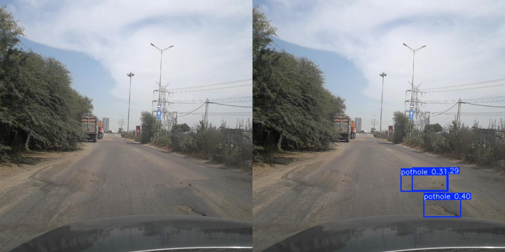
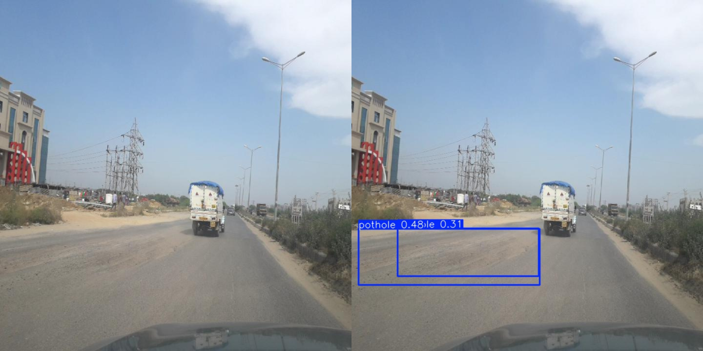

#  Road Damage Detection System

A Machine Learning project that automatically detects road surface damage using YOLOv12. The system identifies potholes and cracks from road images, enabling faster and more efficient road inspection.

---

## Overview

Manual road inspection is time-consuming, expensive, and prone to human error. This project leverages deep learning to automate the detection of road defects from images, making infrastructure monitoring more accurate and scalable.
The model was trained on over **27,000 annotated road images** containing multiple road damage categories and optimized for real-world conditions using data augmentation techniques.

---

## Key Highlights

- Developed a road damage detection model using **YOLOv12**
- Trained on **27K+ annotated images** from RDD2022 dataset
- Detects:
  - 🕳️ Potholes
  - 🛣️ Road Cracks
- Achieved **96% mAP / Accuracy**
- Improved robustness by **25%** using data augmentation:
  - Rotation
  - Scaling
  - Brightness variation
  - Image transformations
- Integrated LLM-based reasoning for contextual classification and labeling of detected road defects.

---

## Technologies Used

- Python
- YOLOv12
- PyTorch
- OpenCV
- NumPy
- Matplotlib

---

## Sample Predictions

### Detected Road Damages

|Before and After Detection |
|---------------------------|
|         |
|         |

---

##  Real-World Applications

- Smart City Infrastructure
- Automated Road Inspection
- Municipal Road Maintenance
- Highway Monitoring
- Autonomous Driving Assistance
- GIS & Road Asset Management

---

## Note

This repository is intended to showcase the implementation, methodology, and results of the project. It is **not** the complete source code repository.
